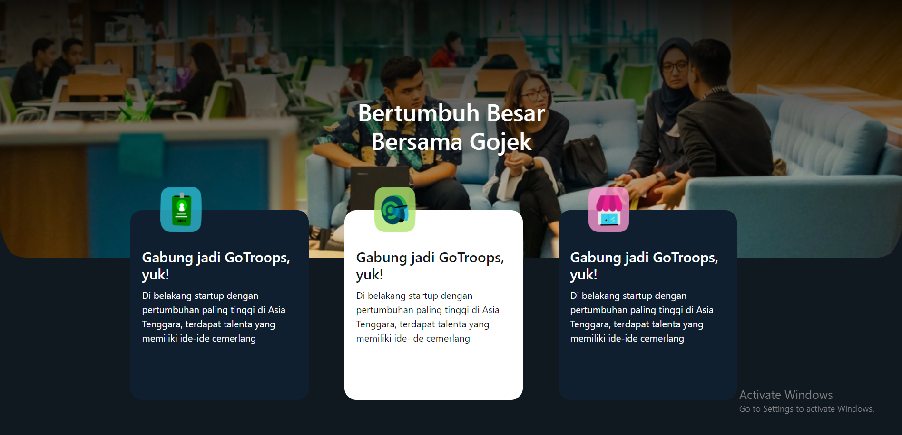
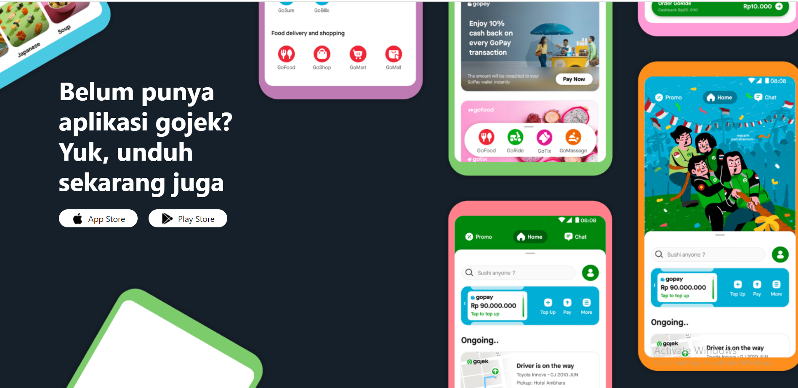

<h1>Teknoologi yang digunakan</h1>
<ul>
 <li>Link Figma :  <a class="" href="https://www.figma.com/community/file/1294182214727352119/gojek-landing-page-website?searchSessionId=ls0eq3ly-4okpyd4nnta" >Klik disini</a></li>
 <li>HTML</li>
 <li>CSS</li>
 <li>Bootstrap</li>
</ul>

<h1>Tampilan Website</h1>
<ul>
 <li>Navbar dan Hero </li>
 
 

 
<li>Section Perkenalan </li>
 
 

 
 <li>Section Skala </li>
 
 

 
 <li>Section Caraousel</li>
 
 

 
 <li>Section Bertumbuh </li>
 
 

 
 <li>Section Slider </li>
 
 

 
 <li>Section Perjalanan </li>
 
 

 
 <li>Section Aplikasi </li>
 
 

 
 <li>Footer </li>
 
 
</ul>
